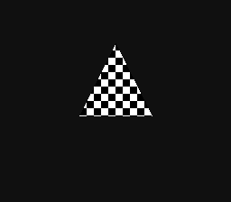

# DiscoC: A Systems Language and Cross-Compilation Toolchain

[](https://github.com/DiscoLabOfficial/DiscoC/actions/workflows/cmake.yml)

DiscoC is a freestanding systems programming language and compiler, assembler,
and linker for specialized hardware. Its C-like syntax is paired with explicit
rules for small integers, banked memory, hardware access, and target capabilities.
It is not an ISO C implementation.

The toolchain is written in C++23, with a C++14-compatible experimental DOS
cross-build. The executable backend targets the SNES SuperFX (GSU); SPC700
currently provides a frontend and IR foundation.

> **Status: v0.1.0 baseline / Experimental**
> Correctness and explicit language contracts take priority over speed. GSU
> compilation, assembly, linking, and runtime regressions are implemented, but
> this is not a production-ready compiler. The current language is frozen as
> **DiscoC Language Baseline 0.1**. Syntax, ABI and object format may change
> before 1.0; optimization is immature and generated code is not yet expected
> to be optimal. A linked `.bin` is a GSU payload, not a complete SNES ROM.

The [0.1 stabilization contract](docs/baseline-0.1.md) and
[release-readiness record](docs/release-readiness-0.1.md) define baseline
acceptance and compatibility limits. The first baseline release does not depend
on further optimization or executable SPC700 support.

## DiscoC 0.1.0

DiscoC 0.1.0 establishes the first documented and tested language/toolchain
baseline, with an end-to-end functional SuperFX target.

See the [release notes](docs/release-notes-0.1.0.md) for compatibility limits and
the [v0.1.0 release](https://github.com/DiscoLabOfficial/DiscoC/releases/tag/v0.1.0)
for packaged tools, documentation and examples. The release remains experimental;
SPC700 is a frontend/IR foundation, not a supported executable target.

## Supported Targets

| Target | Current support |
| --- | --- |
| `gsu` / `superfx` | Source compilation, assembly, relocatable objects, linking, and ROM/RAM execution payloads. |
| `spc700` | Language analysis, target-capability diagnostics, and verified IR inspection; no machine-code emission yet. |

Select the target through the CLI or `discoc.toml`. Hardware-specific features
are capability-checked rather than treated as portable language operations.

## Language

The [Baseline 0.1 language specification](docs/language-spec.md) is the source
of truth for parser, analyzer, IR, backend and examples:

- **Small, predictable values:** signed-by-default `byte` and `word`,
  `unsigned` variants, byte-sized `bool`, and transparent `type` aliases
  including `i8`, `u8`, `i16`, and `u16`.
- **Deliberate numeric rules:** modular overflow for signed and unsigned integers,
  explicit narrowing and signedness conversions, boolean comparisons,
  short-circuit logic, bitwise operators, checked shifts, and software `/` and
  `%` on GSU.
- **Independent access properties:** `rom`/`ram` specify address space,
  `const` restricts modification, and `volatile` preserves observable memory
  accesses through the IR and backend.
- **Bank-aware data pointers:** 16-bit near pointers and four-byte far
  descriptors, pointer arithmetic, indexing, `->`, `null`, and checked casts.
  Far accesses restore the configured near data bank. Typed word accesses
  require two-byte alignment.
- **Memory-resident aggregates:** structs, arrays of structs/pointers, initializer
  lists, and character/string literals. Unsupported aggregate-by-value
  operations are diagnosed instead of silently using an incompatible ABI.
- **Static storage and visibility:** mutable RAM globals, ROM data, explicit
  initialization, and `internal`/`export`/`extern` linkage.
- **Compile-time tools:** `constexpr`, enums, constant-expression array sizes
  and case labels, `sizeof`, `alignof`, `offsetof`, and `static_assert`.
- **Structured control flow:** compound assignments, `++`/`--`, real
  `for` loops with correct `continue` behavior, and explicit
  `fallthrough;` annotations.
- **Stateful SuperFX graphics:** lexical `plot { ... }` blocks, `cursor.x`/
  `cursor.y`, `color`, `pixel`, `read_pixel`, and cache-flushing `flush`.
  PLOT advances X in hardware; direct ROM byte colors can use GETC, while RAM
  and computed colors use COLOR. Symbolic options and bitmap declarations keep
  plot state separate from SNES host screen configuration.
- **Attributes and modules:** `@cache`, `@packed`, `@align(N)`,
  `@target(...)`, and top-level `@cfg(gsu)`/`@cfg(spc700)` selection.
  `import "code.dc";` shares public declarations without copying definitions;
  project builds compile discovered dependencies once in separate objects.
  Declaration-only `.dci` interfaces remain supported. `@...` is for attributes,
  not imports or a C textual preprocessor.

Warnings cover shadowing, unused declarations, uninitialized reads, unreachable
code, and implicit fallthrough. `-Wall` also enables expensive-helper warnings;
`-Werror` turns enabled warnings into errors.

## Toolchain

- `discc` compiles one source file or builds a multi-file project from
  `discoc.toml`. `--check` checks the frontend/IR without emitting objects;
  `--emit-ir` prints the verified IR.
- `discas` assembles DiscoC's ca65-like assembly dialect into relocatable
  objects.
- `discld` resolves symbols, validates placement and relocations, and produces
  a fixed-origin payload with optional runtime initialization and final
  assembly export.

The canonical backend uses typed IR and a control-flow graph, stable resolved
symbol IDs, a dedicated IR verifier, and linear-scan register allocation.
GSU lowering includes hardware-loop selection, switch dispatch optimization,
and branch relaxation. The ABI uses `R9` as frame pointer and `R10` as stack
pointer, with regression coverage for nested calls and stack restoration.

Objects use a versioned little-endian format with CODE/DATA/RAM images,
visibility, relocations, and alignment metadata. The reader and linker reject
malformed records, invalid relocation spans, and unsupported bank crossings.
Rebuild the tools together when the object format changes.

## Building from Source

Install a C++23-capable compiler. CMake is the primary build system; the helpers
also support direct GCC/Clang builds. With CMake 3.21+ and Ninja installed,
the same happy path works on Linux, macOS and a Windows MSVC Developer shell:

```sh
cmake --preset release
cmake --build --preset release
ctest --preset release
```

The tools are `build/release/bin/discc`, `discas`, and `discld` (with `.exe` on
Windows). Windows MinGW users can select the standalone, statically linked
runtime preset instead:

```powershell
cmake --preset release-mingw
cmake --build --preset release-mingw
ctest --preset release-mingw
```

Its tools are in `build/release-mingw/bin`. `debug` and `debug-mingw` presets
use separate build directories. Add the chosen `bin` directory to `PATH` for
your terminal session, then `discc build` discovers the current directory's
`discoc.toml`. Compiler and project output directories are separate.

Build helpers remain available:

```powershell
# Windows: build the tools and run the tests
.\build.cmd -Test

# Direct GCC build, without configuring a CMake project
.\build.cmd -Backend Direct -Compiler g++
```

```bash
# Linux/macOS: build the tools and run the tests
bash build.sh --test

# Alternatives
make test
bash build.sh --backend direct --compiler clang++
```

The default helper build directory is `build/<backend>-<configuration>`, such as
`build/cmake-Release`; its executables are in `bin/`. CMake, Visual Studio and
direct GCC/Clang builds use the same `<build-dir>/bin` convention.

Manual CMake builds remain supported:

```bash
git clone https://github.com/DiscoLabOfficial/DiscoC.git
cd DiscoC
cmake -S . -B build/native -DCMAKE_BUILD_TYPE=Release
cmake --build build/native --config Release --parallel
ctest --test-dir build/native -C Release --output-on-failure
```

See [Building DiscoC](docs/building.md) for prerequisites, MinGW/MSVC selection,
static linking, direct-build tests, and the retained experimental DOS
cross-build. Use a fresh build directory when changing compilers or generators.
An optional local `cmake --install build/release --prefix <directory>` installs
only the three tools into `<directory>/bin`; it does not publish a release.

## Quick Start: A Multi-File Project

Create these two source files. This example writes 42 to a host-agreed RAM
address rather than treating registers after `STOP` as a result API.

```c
// main.dc
import "math.dc";

void main() {
    volatile word* output = (volatile word*)0x0100;
    *output = add(30, 12);
}
```

```c
// math.dc
word add(word a, word b) {
    return a + b;
}
```

Place `discoc.toml` alongside them:

```toml
[project]
name = "multifile"
target = "gsu"
sources = ["main.dc"]

[target.gsu]
memory_mapping = "lorom"
execution_memory = "ram"
origin = 0x700900
ram_bank = 0x00
stack_pointer = 0x2000

[runtime]
initialize = true

[output]
directory = "build"
binary = "multifile.bin"
assembly = "final.s"
```

Then run:

```bash
discc build
# Equivalent explicit selection:
discc --project discoc.toml
```

The import discovers `math.dc`; it does not paste its function body into
`main.dc`. Each source is parsed/compiled once per build. Symbols are public by
default; `export` makes that explicit, and `internal` hides helpers and data.

This produces `build/0-main.o`, `build/1-math.o`,
`build/multifile.bin`, and `build/final.s`. The result is stored at
`$70:0100`; load the payload at `$70:0900` and enter there with the host setup
described below.

To build the repository's original multi-file example from the repository root:

```bash
discc build --config examples/multifile/discoc.toml
```

### Optimized GSU code

Use `-O` (alias `-O1`) for local optimization or `-O2` for global SSA/CFG
optimization. The default `-O0` retains the baseline generation policy:

```sh
discc build -O
discc -O1 main.dc -o main.o
discc build -O2
```

Or enable it for a project and all discovered source dependencies:

```toml
[compiler]
optimize = true
```

CLI wins: `discc build -O0` overrides `optimize = true`. O1 reduces expression
spills, stack traffic and instruction overhead without changing the ABI,
language semantics, pointer checks, or volatile accesses. It uses `IBT` only
when its sign-extended byte equals the required 16-bit value. Plot cursor
registers stay reserved; PLOT still performs the physical X increment.
It also selects `SBK` for word stores when the implicit last-RAM address is
proven unchanged; stack accesses, spills, bank changes and calls fence reuse.
O1 folds scalar constants through casts, specializes high-byte shifts/bit
extraction, removes adjacent accumulator copies, keeps short local branches
where they fit, and forwards proven unescaped scalar-local loads/stores.
It also selects direct allocated ALU destinations, reuses identical pure
block-local expressions, removes overwritten unobserved local stores, and
specializes power-of-two multiply/divide/remainder with signed truncation
toward zero. Whole mask/shift patterns can become a single bit extraction.
Unknown writes, calls, volatile accesses, framebuffer effects and control-flow
boundaries invalidate memory facts; pointer checks remain intact.

O2 adds pruned scalar-local SSA with PHIs, full CFG/hardware-loop liveness,
cross-block R5/R7/R8 allocation, shared spill slots, safe loop-invariant motion,
checked address induction and bounded leaf inlining/constant specialization.
SCCP propagates typed constants through executable PHI edges and simplifies
constant branches/switches, unreachable paths and straight-line CFG chains.
Bounded frame/address proofs remove only redundant near-RAM checks; stack
checks reuse established bounds without moving failures ahead of effects.
R1/R2 remain reserved for plotting, and nested LOOP scopes preserve R12/R13.
Matching word `/` and `%` operations can share a single `divmod` helper.
Function-local terminal faults/epilogues share code, and bounded PHI affinity
improves register/spill copies without weakening interference or fault checks.
Pure scalar GVN reuses dominating expressions across blocks. Small nonescaping
arrays/struct fields with constant indices can become separate SSA cells.
Known-bit/range proofs simplify masks and comparisons; modular numeric induction
replaces eligible repeated products with increments. Bounded hot/cold lifetime
splitting and proven accumulator snapshots reduce register-pressure traffic.
It also fills proven one-byte delay slots, schedules independent work during
ROM-buffer reads, keeps hot loop/PHI edges together and aligns cached function
entries at their actual link address. Split IWT/IBT delay-slot operand tricks
are tested but not generated automatically.
Select it for every project unit with:

```toml
[compiler]
optimization_level = 2
```

Use this key **instead of** `optimize`; it accepts integers 0/1/2 or `"s"` for Os. CLI still
wins. O2 preserves the object/call ABI, volatile effects and checked failures,
but can trade a little code size for fewer cycles; measure your workload.
`discc -O2 --emit-ir main.dc` displays optimized SSA.
See [optimization and measured results](docs/optimization.md).
The [five focused O2 workloads](benchmarks/optimizer/README.md) retain verified
before/after bytes and opcode counts. The rotating triangle's latest measured
change is 3,114 → 3,008 payload bytes and 4.26% fewer mean GSU cycles; completed
image throughput stays about 6.70 FPS in its fixed 21 MHz Mesen profile.
O2 now compares bounded allocator candidates with a GSU fetch/RAM/call cost
model and retains safe spill copies in temporarily free R5/R7/R8 registers.
See [profiling and allocator results](docs/optimization.md#profiling-cost-model-and-allocation).

Use `-Os` when payload size matters more than speed:

```sh
discc -Os main.dc -o main.o
discc build -Os
```

```toml
[compiler]
optimization_level = "s"
```

Os reuses SSA/SCCP/GVN/dead-code elimination, compares bounded candidates by
actual emitted bytes, pools repeated division/remainder kernels only when
calls and register preservation amortize, shares exact effectful tails and
omits optional CACHE padding. Required alignment, explicit CACHE, volatile
effects, graphics state and checked failures remain intact. It may trade
cycles for bytes; the current rotating triangle stays identical to O2 rather
than acquiring a larger helper. A verified signed/unsigned division probe
shrinks 657 → 536 bytes with about 2.1% more emulated cycles. Conversely,
`triangle_fill` saves 8.1% of its bytes but runs about 2.60 times slower;
prefer O2 for speed-critical drawing. See the [size policy and measurements](docs/optimization.md#size-policy--os).

Configuration precedence is **built-in defaults → manifest → explicit CLI
options**. Manifest paths resolve relative to the manifest, not the terminal's
working directory. Root sources and outputs are explicit, while `.dc` imports
discover source dependencies. This is not a package manager or an incremental
build system.

Imports search the current source directory first, then configured directories:

```toml
[compiler]
import_paths = ["src", "lib"]
```

These paths are manifest-relative. Repeat `--import-path DIR` (or `-I DIR`) to
replace the configured list with CLI-relative directories. See the
[source-import example](examples/source_imports/README.md) for shared dependencies,
imported types/constants, and RAM/ROM data.

See [Project manifests](docs/project-manifest.md) for the supported TOML subset,
schema, output-path rules, CLI overrides, and frontend-only project checks.

## Individual Commands and Assembly Export

The separate compile/link workflow remains available for the same source files:

```bash
discc main.dc -o main.o
discc math.dc -o math.o
discld main.o math.o --origin 0x700900 --init-runtime \
  --ram-bank 0 --stack-pointer 0x2000 --emit-asm final.s -o multifile.bin
```

Ordinary `discc main.dc` checks its import graph but emits only `main.o`; compile
and link each dependency separately, or use `discc build` to do that automatically.

There are two distinct assembly exports:

```bash
# Relocatable assembly for one compilation unit
discc main.dc --emit-asm -o main.s
discas main.s -o main.o

# Inspect target-independent IR, or check language rules only
discc main.dc --emit-ir
discc --check -Wall -Werror main.dc

# SPC700 currently supports frontend/IR workflows only
discc --target spc700 --check main.dc
```

Compiler assembly preserves symbols and relocations. Without edits, assembling
and linking it with the same options produces the same bytes as direct object
compilation.

`discld --emit-asm final.s`, or `discc build --emit-asm final.s`, exports the
**final linked payload**, including startup and resolved addresses. Reassemble
it without adding startup or changing its origin:

```bash
discas final.s -o reconstructed.o
discld reconstructed.o -o reconstructed.bin
```

`reconstructed.bin` matches the linked payload byte for byte. This is DiscoC
assembly, not native WLA-DX syntax; `.byte` directives preserve encodings when
needed.

## GSU Placement and Host Integration

LoROM with ROM execution at `$00:8000` is the default. HiROM remains an explicit
`--memory-mapping hirom` choice, independent of RAM/ROM execution.
Placement belongs in the CLI or manifest, not source-level `set` directives.

For the quick-start RAM payload, the host must copy it to `$70:0900`, set
`PBR=$70` and `R15=$0900`, grant the required bus access, and configure the
other SNES/GSU registers. The bootstrap selects near RAM/stack bank `$70`,
initializes `R10`, and enters `main`. After normal completion, the host can
read the word at `$70:0100`.

The binary is fixed-origin, **not position-independent**. Storing it with
WLA-DX `.incbin` does not relocate it. Relink to change its execution address;
the complete payload must fit one accessible program bank.

Mutable globals begin at near RAM offset `$0400` by default; `--ram-origin`
changes that placement. Use `--init-runtime` for static initialization, or
explicitly accept the host-owned contract with `--host-initialized-globals`.
Without runtime initialization, the host also owns the initial stack/data-bank
setup.

Far data accesses do not implement interbank code calls. RAM execution does not
yet provide separate ROM placement for ROM-qualified constants. The host remains
responsible for real cartridge capacity, memory reservations, stack space, and
valid ROM integration. See [GSU loading and startup](docs/gsu-loading.md).

## PLOT: Stateful SuperFX Graphics

DiscoC can calculate and draw a bitmap using the GSU's real plotting state.
This triangle was compiled from [the official example](examples/snes/triangle/main.dc),
copied to cartridge RAM, and displayed by a complete SNES test ROM in Mesen:


The triangle has 97 scanlines and **9,409 pixels**. Its edges and color bands
are calculated in DiscoC, not supplied as a pre-rendered image. The accompanying
[SNES host and Mesen checks](examples/snes/triangle/README.md) verify the
framebuffer, VRAM transfer, tilemap, and CPU-read result after STOP.

`plot { ... }` exposes a stateful cursor and color rather than independent
draw calls:

```c
plot {
    options transparent;
    color 5;
    at (10, 20); // cursor.x = 10; cursor.y = 20;

    for (word i = 0; i < 16; i++) {
        pixel; // Draw at the cursor; hardware advances X by one.
    }

    byte c = read_pixel at (10, 20);
    flush;
}
```

- `cursor.x` and `cursor.y` map to GSU R1 and R2. Assign them directly or use
  `at (x, y);` to set both; values persist across pixels and loop iterations.
- `color expr;` updates COLR, the current color index. Immediate, computed,
  and RAM-backed values use COLOR. An eligible direct ROM byte read can use
  GETC with the required ROM bank, R14, and ROM-buffer setup.
- `pixel;` emits PLOT. It draws using the current cursor and COLR, then
  **increments X in hardware**; no extra R1 increment is emitted. Y is unchanged.
- `read_pixel` uses RPIX to flush pixel caches and read a logical color index.
  It does not advance X. `flush;` uses the same instruction with its result
  discarded and is preserved even when no value is needed.
- `options` accepts `transparent`, `dither`, `high_nibble`, `freeze_high`, and
  `object`; `options;` clears them. `draw at (x, y) with color c;` is convenient
  sugar for setting color and cursor, then drawing one pixel.

Bitmap declarations describe the framebuffer separately from the plotting state:

```c
bitmap main_screen {
    mode bitmap;
    size 256x192;
    depth 4bpp;
    base 0x0000;
}
// In a function, before drawing:
// use bitmap main_screen;
```

Bitmap modes support 256x128, 256x160, or 256x192 at 2/4/8bpp. OBJ profiles use
`mode obj;` without a bitmap `size`. The compiler checks combinations and base
alignment; the SNES host still owns SCMR/SCBR setup, bus access, CGRAM, and PPU
display. A bitmap declaration does not initialize those registers automatically.

To compile the pictured RAM triangle, with the DiscoC tools on `PATH`:

```sh
discc build --config examples/snes/triangle/discoc.toml
# With WLA-DX installed, build the complete SNES ROM:
cmake -P examples/snes/triangle/build-snes.cmake
# Additionally verify all pixels, VRAM/tilemap and the negative ROM in Mesen:
cmake -DVERIFY_MESEN=ON -P examples/snes/triangle/build-snes.cmake
```

This `.bin` is a fixed-origin payload, not a standalone SNES ROM. The example's
portable build script assembles the complete host ROM with WLA-DX and optionally
verifies it in Mesen. Outputs go to `build/snes-triangle`; the host consumes
origin/SCBR/SCMR from the final linked export. See
[the triangle build instructions](examples/snes/triangle/README.md)
for that workflow and [SuperFX graphics](docs/gsu-graphics.md) for the full contract.

### Rotating Checkerboard Triangle

From DiscoC source to a running SuperFX animation: this demo calculates both
the rotating triangle and its black-and-white checkerboard using integer
fixed-point math. There are no pre-rendered frames, and the SNES CPU only
selects the angle and transfers the completed GSU framebuffer during VBlank.



Real Mesen captures, replayed at **8 fps**. Playback is accelerated; the ROM
is a correctness demonstration, not yet a smooth-animation benchmark.
The host starts each new render immediately after presentation, with no
six-VBlank hold. Missed refreshes repeat the last completed image; VRAM uploads
remain inside VBlank. The verified run reports completed-pose FPS separately
from the GIF playback rate and GSU-only render time.

Here is the actual drawing loop from the demo's `plot` block. Scanline clipping
provides `left` and `right`; `sine` and `cosine` are Q6 rotation coefficients.
Sampling local coordinates `u` and `v` makes the checker pattern rotate with
the triangle:

```c
word u = left * cosine + dy * sine;
word v = -left * sine + dy * cosine;
at (128 + left, y);
@cache
for (word x = left; x <= right; x++) {
    // Bit 9 of Q6 is an eight-pixel checker cell. Sampling
    // local u/v rotates the pattern with the geometry.
    word shade = 1 + (((u ^ v) & 512) >> 9);
    color shade;
    white += shade - 1;
    black += 2 - shade;
    pixel; // PLOT alone advances the hardware X cursor.
    pixels++;
    u += cosine;
    v -= sine;
}
```

The cursor is positioned once per scanline; each `pixel;` advances X in
hardware. `@cache` requests instruction caching, and the frame ends with
`flush;` before the host reads RAM. The pixel loop is only partially cached;
the generated clearing loop fits entirely in the instruction-cache window.

The [complete DiscoC program](tests/graphics/rotating_triangle/triangle.dc)
includes the sine table, rotation, clipping, previous-frame clearing, and
host-visible diagnostics. With the DiscoC and WLA-DX tools on `PATH`, build
the complete SNES ROM from the repository root:

```sh
cmake -DOPTIMIZATION=2 -P tests/graphics/rotating_triangle/build-snes.cmake
```

Open `build/plot-rotating-triangle/rotating-triangle.sfc` in a SuperFX-capable
SNES emulator. The optional Mesen checks compare **all 49,152 pixels at all
64 angles**, including phase wrap, RAM/VRAM transfers, and the red-screen
failure path. See [build and verification instructions](tests/graphics/rotating_triangle/README.md).

### Interactive OBJ Cube and Sphere

The [interactive shapes demo](tests/graphics/interactive_shapes/README.md) renders
a 3D wireframe cube and an icosahedral sphere, switching to filled colored faces
with A. The D-Pad rotates both axes; Select + Up/Down resizes. It uses genuine
GSU OBJ/4bpp layout and two SNES sprites, with the GSU at approximately 21 MHz.
Geometry is integer-only, with shared projections, cached PLOT spans and
hardware cursor increments. The host samples controls even during rendering,
uploads only complete poses during VBlank and skips unchanged poses.

```sh
cmake -DDISCO_TOOLS_DIR=build/release/bin -P tests/graphics/interactive_shapes/build-snes.cmake
```

Open `build/interactive-shapes/interactive-shapes.sfc`. Optional Mesen tests
verify actual controller transitions and compare every framebuffer/VRAM byte
and the visible sprite image against an independent rasterizer.

## Freestanding Libraries and Examples

`lib/core` provides near-RAM byte copy/move/fill routines and signed Q8.8/Q12.4
fixed-point helpers. Fixed-point aliases are transparent integer types with
explicit scaling helpers, not new primitive types or floating-point support.
`lib/targets/gsu` contains target-specific graphics wrappers.

Import a library's `.dci` interface and explicitly compile/link its matching
`.dc` implementation, or list it in `project.sources`. Importing an interface
does not automatically add an implementation to the build.
Alternatively, import the `.dc` implementation directly and let a project build
discover and compile its source dependencies.

Useful examples:

- [Language core](examples/language_core/README.md): qualifiers, globals,
  numeric operators, and lexical plotting.
- [Module interfaces](examples/language_modules/README.md): shared types,
  declarations, and multi-file linking.
- [Source imports](examples/source_imports/README.md): automatic project discovery,
  shared dependencies, and configurable import paths.
- [SNES triangle](examples/snes/triangle/README.md): canonical source, TOML,
  WLA-DX host, complete ROM and independent Mesen checks for Baseline 0.1.
- [Fixed-point and memory helpers](examples/fixed_point/README.md): portable
  core modules and explicit library linking.
- [RAM result](examples/ram_result/README.md): host-visible output and startup.
- [Stateful plotting](examples/plot.dc): a ROM-colored scanline triangle.
  See [SuperFX graphics](docs/gsu-graphics.md) for its host setup and build commands.
- [SNES triangle test](tests/graphics/triangle/README.md): RAM-executed plotting,
  a complete WLA-DX host ROM, and optional Mesen framebuffer/display checks.
- [Rotating checkerboard](tests/graphics/rotating_triangle/README.md): fixed-point
  rotation, persistent animation, VBlank uploads, and checks at all 64 angles.

See the [freestanding library contract](docs/freestanding-library.md) for API,
rounding, overflow, and memory-access limits.

## Validation and Current Limits

CTest covers language conformance, negative diagnostics, parser/object
hardening, IR verification, multi-file linking, placement boundaries, project
manifests, assembly/binary equivalence, and GSU execution regressions.
Optional sanitizer and fuzzing configurations are documented in
[Testing](docs/testing.md).

### Measuring backend optimization

Nine [GSU workloads](benchmarks/README.md) measure code/payload size, executed
opcodes, loads/stores, stack accesses, graphics instructions and control flow.
Each result is checked before reporting, and the same suite/model compares
current tools with the published v0.1.0 baseline:

```sh
cmake --build --preset release --target benchmarks
cmake --build --preset release --target benchmarks-O1
cmake --build --preset release --target benchmarks-O2
cmake --build --preset release --target benchmarks-Os
```

JSON/CSV measurements and signed comparison deltas are written to
`build/release/benchmark-results`, `benchmark-O1-results` and
`benchmark-O2-results` and `benchmark-Os-results`. These are instruction-level measurements,
not cycles or FPS; no speedup is claimed from an opcode reduction alone.

For calibrated **emulated cycles**, the optional `benchmarks-mesen` and
`benchmarks-mesen-O1`/`benchmarks-mesen-O2`/`benchmarks-mesen-Os` targets
run the same nine payloads in complete SNES ROMs, with a fixed clock/ROM/cache
profile and independent result/framebuffer checks. It reports SNES master
clocks and fast GSU clock ticks separately, preserving the observed interval
and the model-derived STOP completion cost. See the
[timing setup and limits](benchmarks/README.md#optional-mesen-timing).
The optional `benchmarks-profile-O2` target additionally records verified
opcode-entry intervals by function, linked machine-label region and opcode
category. Use these [profiling reports](benchmarks/README.md#gsu-profiling) to
identify expensive code; they are not independent instruction latencies or PGO.
WLA-DX/Mesen are external prerequisites; these are not physical-hardware timings.

With the documented cold-entry LoROM profile, `triangle_fill` changes from
1,200 to 383 code bytes and 7,359,330 to 1,997,705 emulated fast GSU cycles
with O1. All nine workloads retain their independently checked results.
These figures describe the fixed benchmark profile, not a general FPS claim.

The initial O2 snapshot reduces `triangle_fill` to 872,075 emulated cycles
with 395 code bytes; stack accesses fall from 39,294 to 1,367. The unchanged
21 MHz cache-enabled rotating checkerboard uses 4,766 payload bytes and averages
3,279,943 cycles across 64 poses, 0.62% fewer cycles but 45 more bytes than O1.
All 64 screenshots match. O2 does not win every workload: `arithmetic` is
0.52% slower despite smaller code. See the
[full O2 comparison and measurement limits](docs/optimization.md#global-o2-ssa-allocation-and-loops).

O2's subsequent pipeline scheduling reduces `triangle_fill` further to 393 code
bytes and 870,625 cycles, and `function_call` from 46,450 to 46,130 cycles.
A cache-resident ROM-read calibration falls from 99 to 96 cycles. The rotating
checkerboard saves 29 payload bytes (4,737 total), but its 64-pose average rises
0.12% to 3,283,994 cycles; all screenshots remain identical. Blanket loop-CACHE
padding was measured and rejected. See the
[pipeline results and boundaries](docs/optimization.md#pipeline-measurements).

SCCP/CFG cleanup further reduces `triangle_fill` to **390 code bytes and
822,610 emulated cycles** (5.51% fewer cycles than pipeline O2). Four of the
nine fixed workloads improve and five remain equal. The unchanged 21 MHz
RAM/CACHE rotation averages **3,276,385.125 cycles** over 64 poses (0.23% less),
with **4,748 payload bytes** (11 more). All pixels/screenshots still match;
O0/O1 payloads remain unchanged. See the
[SCCP comparison and tradeoffs](docs/optimization.md#sccp-and-cfg-measurements).

Proven-check elimination reduces the same rotating payload further to
**3,453 bytes** (27.3% smaller) and **3,158,312.75 mean emulated cycles**
(3.6% fewer). All 64 poses/screenshots match. Each of the nine benchmarks also
shrinks and improves its timing, with unchanged memory/graphics counts;
O0/O1 payloads remain identical. Unknown/illegal accesses retain their checks.
See [proof rules and measured results](docs/optimization.md#proven-check-elimination-measurements).

Divmod fusion and shared-code/PHI improvements reduce the same payload to
**3,126 bytes** (another 9.47% smaller) and **3,045,929.8125 mean emulated cycles**
(another 3.56% fewer), with all 64 screenshots unchanged. Every benchmark
shrinks; `arithmetic` drops from 148,479 to 81,229 cycles, while the other eight
retain their timing. See [comparison and boundaries](docs/optimization.md#divmod-and-shared-code-measurements).

The default execution tests use an instruction-level GSU model. A separate,
optional static and rotating triangle integration tests have also been verified
in Mesen using complete SNES ROMs, including the host and PPU display. This does not constitute
physical-hardware validation; test your ROM in its deployment environment.

SPC700 machine emission and DSP libraries, interbank calls, aggregate-by-value
ABI support, function pointers, and unions remain future work. Inline assembly
and interrupt/naked/section/calling-convention attributes have
[design contracts](docs/inline-assembly-contract.md), not implemented source
semantics. BF16/FP16 and wider fixed-point arithmetic are also deferred.

See [ROADMAP.MD](ROADMAP.MD) for completed milestones and future work.

## Technical Documentation

- [Language specification](docs/language-spec.md): supported semantics and
  compatibility limits.
- [Baseline 0.1](docs/baseline-0.1.md) and
  [language conformance](tests/language/README.md): stabilization acceptance,
  rule-to-test index and release boundaries.
- [Project manifests](docs/project-manifest.md): TOML configuration and builds.
- [GSU optimization](docs/optimization.md): O0/O1/O2/Os policies, special registers,
  preserved semantics and measured size/cycle improvements.
- [Architecture](docs/architecture.md): compiler pipeline, ABI, and ownership.
- [IR and CFG](docs/ir-cfg.md): intermediate representation and verification.
- [Object format](docs/object-format.md): serialization and relocation contracts.
- [Assembler](docs/assembler.md): supported assembly syntax and workflows.
- [GSU loading](docs/gsu-loading.md): execution origins and host initialization.
- [SuperFX graphics](docs/gsu-graphics.md): cursor state, color selection,
  pixel-cache effects, bitmap metadata, and migration from the old API.
- [SPC700 foundation](docs/spc700-target.md): target model and planned backend.
- [Building](docs/building.md) and [Testing](docs/testing.md): build paths and
  regression tooling.
- [GSU benchmarks](benchmarks/README.md): workloads, counters and reproducible
  v0.1.0 versus O0/O1/O2 comparisons.

## License

DiscoC is free software: you can redistribute it and/or modify it under the terms of the **GNU General Public License as published by the Free Software Foundation, either version 3 of the License, or (at your option) any later version.**

This program is distributed in the hope that it will be a useful, but WITHOUT ANY WARRANTY; without even the implied warranty of MERCHANTABILITY or FITNESS FOR A PARTICULAR PURPOSE. See the GNU General Public License for more details.

You should have received a copy of the GNU General Public License along with this program. If not, see <https://www.gnu.org/licenses/>.
